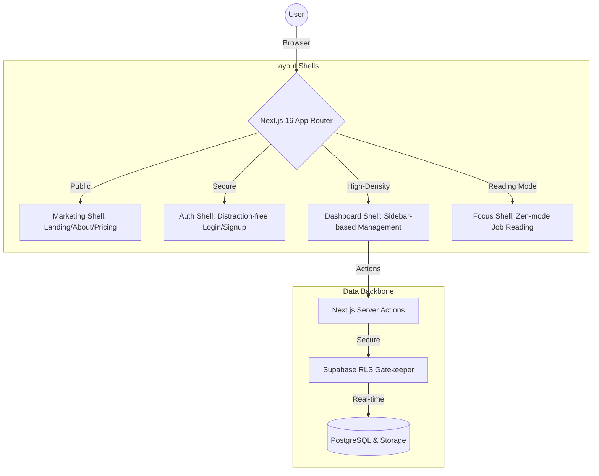

# 💼 JobBoard Elite: The Standard for Modern HR Intelligence

### _Next.js 16 | Supabase Realtime | Cloud-Native AI | Stripe Enterprise_

**JobBoard Elite** is a high-performance, real-time job marketplace architected as a **Proof of Competence** for high-stakes SaaS development. It demonstrates a mastery of scalable system design, complex state management, and the "Library-First" assembly pattern favored by high-velocity startups.

---

## 🏗️ Sophisticated System Architecture (The 4 Shells)

Unlike typical "page-based" applications, JobBoard Elite is built on a **Shell Architecture** pattern. This ensures strict separation of concerns, optimized caching boundaries, and a "Zero-Distraction" user experience.

---

## 🛠️ Performance & Engineering Depth (Hard Problems Solved)

This project proves that "Flashy UI" is built on top of "Robust Logic."

| Hard Problem              | The "Standard" Way                      | The "Elite" Way (Our Solution)                                                                                            |
| :------------------------ | :-------------------------------------- | :------------------------------------------------------------------------------------------------------------------------ |
| **Infinite Render Loops** | Putting page state in `useEffect` deps. | **`useReducer` Pattern**: Decoupling dispatch from state closure to break dependency cycles in complex hooks (`useJobs`). |
| **Layout Drift (CLS)**    | Blank screens during data loading.      | **Pixel-Perfect Skeletons**: Implementing Skeleton states that occupy the exact layout volume of the final component.     |
| **AI Latency Feel**       | Waiting for full JSON response.         | **Vercel AI SDK Streaming**: Real-time requirements generation with 0ms perceived latency for the user.                   |
| **Data Integrity**        | Client-side tracking logic.             | **Postgres RPCs**: Handling analytics (view counts/conversions) directly on the DB layer for 100% accuracy.               |

---

## 💎 The "Library-First" Assembly (Atomic Registry)

We don't reinvent the wheel. We assemble world-class tools into a custom "Glow-up" design system.

- **Atoms (Base Elements)**: **shadcn/ui** primitives customized with OKLCH emerald branding.
- **Molecules (UI Logic)**: **Magic UI** tokens integrated for micro-interactions (e.g., `NumberTicker`, `DotPattern`).
- **Organisms (The Wow)**: **Aceternity UI** components for structural storytelling (`BentoGrid`, `BackgroundBeams`).

---

## 🚀 The Feature Suite

### 1. 🤖 HR Intelligence (AI Orchestration)

- **Engine**: Gemini 2.5 Flash.
- **Goal**: Employer productivity. Generate Recruiter-grade job descriptions and requirements in seconds via streaming text.

### 2. ⚡ Real-Time Infrastructure (Unified Loop)

- **Engine**: Supabase WebSockets.
- **Goal**: Zero-latency feedback. Instant notifications and chat updates across all active client instances.

### 3. 💳 Payment Hub (Production Ready)

- **Engine**: Stripe Checkout + Webhooks.
- **Goal**: Revenue generation. Feature-flagged billing system that separates local testing from production deployment.

---

## 📦 Technical Stack (The Algorithm SEO)

| Category       | Technology                                        |
| :------------- | :------------------------------------------------ |
| **Framework**  | Next.js 16 (Turbopack), React 19, TypeScript 5.5  |
| **Auth & DB**  | Supabase Auth/SSR, PostgreSQL (RPC), RLS Policies |
| **Styling**    | Tailwind CSS v4, Framer Motion, Radix UI          |
| **Components** | shadcn/ui, Magic UI, Aceternity UI                |
| **Automation** | Playwright (E2E), GitHub Actions                  |

---

## 👨‍💻 Professional Posture & Hiring

Built to demonstrate a fast-tracked mastery of modern SaaS development and product-thinking.

- ✅ **Architectural Thinking**: Applying systems-design (The 4 Shells) to ensure long-term maintainability.
- ✅ **Secure & Scalable**: Implementation of production-ready patterns like Supabase RLS and Server Actions.
- ✅ **Rapid Learning**: Proving the ability to integrate enterprise-grade tools (Stripe, AI, Framer Motion) into a cohesive product.

**I am a Product-Driven Full-Stack Developer based in Egypt 🇪🇬, focusing on high-performance Next.js ecosystems and rapid product iteration.**

---

All rights Reserved © JobBoard Elite 2026.
Built with ❤️ for the Modern Web.
